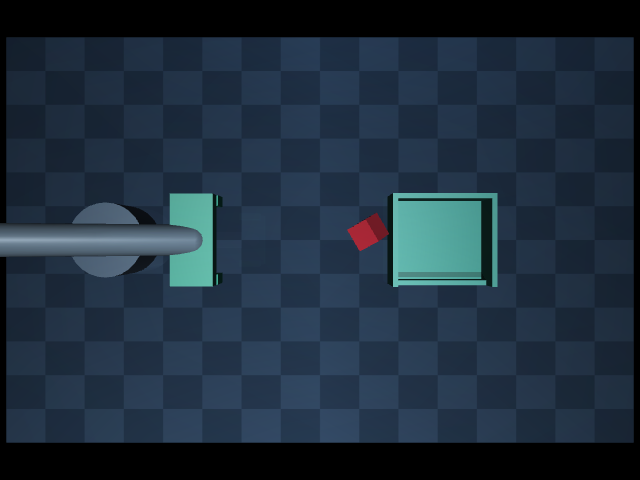

# 剩余倾斜案例的受限等待与重新观测

## 固定实验

使用 corrections-contact-oriented-v1 中训练位置 x=0.302 m、84 帧接管的失败案例。
从保存的完整初始状态重放 float64 执行动作，逐帧核验关节，推进至撤退结束后首次视觉判断前
的第 158 帧。此后保持当时的五维执行器命令，持续推进真实物理最多 **4 秒**，
在 0、0.2、0.4、1、2、4 秒重新获取 RGB-D。

新观测仍使用上一轮 oriented 尺寸判据及原 38–60 mm 门槛；没有放宽阈值、移动相机、
重置物体或执行额外操纵。控制命令逐帧核验不变，重观测不会停止物理或复制旧图像。
仿真位姿和速度只用于解释结果，未传入感知算法或用于放行抓取。

## 结果

| 等待时间 | 最近立方体面相对水平倾角 | 相对起点位移 | 视觉结果 |
| --- | --- | --- | --- |
| 0 s | 37.080° | 0 mm | 拒绝 |
| 0.2 s | 37.052° | 0.008 mm | 拒绝 |
| 0.4 s | 37.023° | 0.017 mm | 拒绝 |
| 1 s | 36.936° | 0.042 mm | 拒绝 |
| 2 s | 36.789° | 0.084 mm | 拒绝 |
| 4 s | 36.487° | 0.171 mm | 拒绝 |

**六次观测均未通过视觉判据，没有出现可重试抓取的观测。**
4 秒时，算法截取的顶面窄条旋转尺寸约为 13.0×49.2 mm，仍低于 38 mm 下限。
物体仍明显倾斜，平移速度约 0.045 mm/s；这支持它在本实验时间范围内变化很慢，
不能据此断言已经完全静止，或更长等待永远不会改变状态。

本轮未执行抓取重试，因为没有合格观测；不能把“六次重新观测”当成六次独立任务评测。
四秒内被动等待未恢复此案例，上一轮专家恢复仍为 5/6，未产生新的合格训练样本。
本轮没有重训、验证位置/预留测试或控制台策略替换。

## 验证与复现

`make bounded-wait-audit` 生成物理回放、六组带标定的 RGB-D、图像和机器报告；
已有输出目录拒绝覆盖。数据保存在 outputs/evaluations/bounded-wait-v1。

已核验：

- 起始 RGB、深度、相机标定与上一轮同状态视觉审计逐值相同。
- 六组 RGB-D 文件哈希均匹配报告；重新调用检测器全部复现相同拒绝结果。
- 仿真时间实际推进恰好四秒，执行器命令保持不变。
- 来源数据哈希未改变，逐帧回放关节一致；代码风格和差异检查通过。

本轮只新增实验脚本和证据，没有修改生产控制或感知代码。机器报告见
[bounded-wait-v1.json](evaluations/bounded-wait-v1.json)。

## 下一步

先检查该倾斜姿态的支撑接触与当前机械臂可达约束，判断是否存在可验证的、受限的
姿态恢复动作；不继续盲目延长等待，也不直接放行被拒绝的顶面。
若现有机构和感知无法支持恢复，应保留明确失败结局，再用已合格的五条恢复轨迹
扩充训练/验证数据，而不是强行将该案例标记成功。

后续[支撑与可达审计](support-reach.md)确认桌面和托盘侧壁共同支撑，并发现直接下降路径的提前碰撞。
