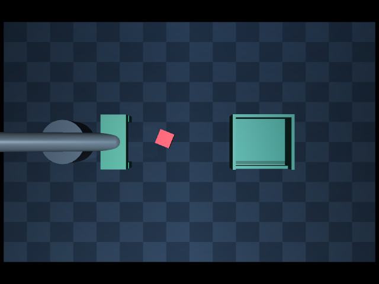
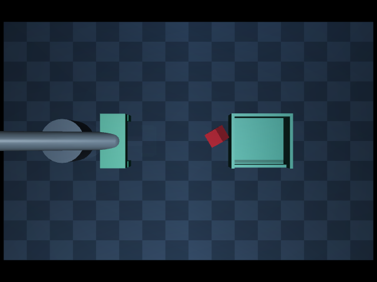

# 撤退后视觉拒绝的 RGB-D 证据

## 范围与方法

精确回放 corrections-contact-stable-v1 中接管帧 79（成功对照）、82、84 三条轨迹，
使用记录的 float64 动作，从完整初始状态推进到专家撤退结束、即将重新定位的帧。
三个判断时刻分别是 153、156、158 帧（6.12、6.24、6.32 秒）。
逐帧核验实际关节与原记录一致，在原 perception 相机下保存 640×480 RGB、深度与标定。

本轮只诊断训练位置，没有重训、改识别门槛或替换控制台策略。新增 optional diagnostics
只收集分割与几何证据；诊断开关不改变检测结果。仿真物体姿态和分割 ID 只用于审计，
不传入检测器或控制器。现有检测器仍假设直立、5 cm 的红方块。

## 结果

| 接管帧 | 图像判断 | 顶面轴对齐 XY 尺寸 | 旋转对齐后的尺寸（仅诊断） | 原检测结果 |
| --- | --- | --- | --- | --- |
| 79 | 正常成功对照 | 47.6×49.6 mm | 47.6×49.6 mm | 接受 |
| 82 | 完整可见，桌面内旋转 | 61.5×63.5 mm | 49.9×50.0 mm | 超过 60 mm 上限而拒绝 |
| 84 | 物体偏移并倾斜 | 33.4×47.0 mm | 12.9×50.0 mm | 小于 38 mm 下限而拒绝 |

三张图均只有一个有效红色连通区域，包围框均远离图像边缘，没有触发边界裁剪或多目标规则。
因此“目标不在视野内”不符合本次观测。

第 82 帧接管案例的物体撤退后位于约 (0.3165, 0.0111, 0.0250) m，面相对水平倾斜约 0°。
照片显示方块不被机械臂遮挡；顶面支持 636 像素。
检测器使用世界 XY 轴包围尺寸，平面内旋转让 5 cm 方块投影尺寸超过 6 cm，造成误拒绝。
对同一 RGB-D 顶面点云搜索最小面积旋转矩形（0.1° 步长），得到 49.9×50.0 mm，
支持平面内旋转是本案例尺寸失败的解释；这不是本轮已部署的检测修正。
旋转矩形角度有 90° 对称性，只用于对齐尺寸，不视为唯一物体朝向估计。

第 84 帧接管案例的物体位于约 (0.4971, 0.0162, 0.0350) m，最近立方体面法向
偏离竖直约 37.1°。图像显示多面，顶面高度附近仅有 162 像素。
现有算法按最高区域 ±3 mm 截取“水平顶面”，对倾斜物体取成窄条，因此测得偏小尺寸。
旋转矩形也仍是窄条，不能按第一个案例的方法直接接受。
其真值 y 还略超过现有抓取平面容差 0.015 m；这只是审计提示，不是检测器当时触发的错误。

上述可见像素计数不是完整遮挡率，不能用它证明零遮挡。综合 RGB 图像、边界检查、
点云尺寸和姿态诊断，本轮证据主要指向旋转敏感尺寸规则与直立假设失效，
不支持把两个失败统一解释成遮挡，也不支持仅增加重复观测就能解决。

## 验证与复现

`make contact-vision-audit`：物理回放、保存 RGB-D，再离线重检。
已有输出目录拒绝覆盖。`make contact-vision-summary` 可单独重新汇总已保存的观测，
先核验 RGB-D 哈希，再确认检测结果和错误文本与原审计逐值相同。

`PYTHONPATH=src .venv/bin/python -m unittest discover -s tests/vision -v` 共 6 项测试通过，
包括旋转尺寸诊断、非法点云、缺失目标诊断不改变拒绝结果，以及真实 RGB-D 抓放、
目标消失和抓取平面外拒绝。代码风格与差异检查通过。

完整数据在 outputs/evaluations/contact-vision-v1，关键图像已纳入本文。
详见[机器报告](evaluations/contact-vision-v1.json)。

## 下一步

先验证对平面旋转不敏感的顶面尺寸判据，同时保留遮挡、深度支持和倾斜拒绝条件，
补充旋转角度与遮挡负例测试，再复查固定六个接管点。对倾斜案例另行设计可验证的
恢复路径；不直接放宽宽高阈值，也不把仿真真值作为控制输入。
